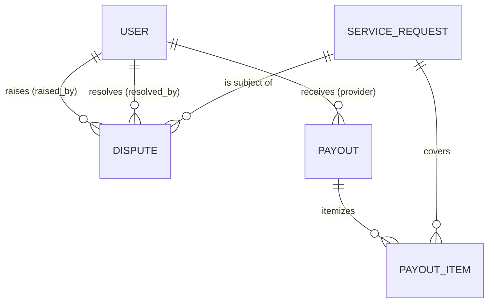

# Phase 1 Data Model: Admin Mobile App

No new tables, models, or migrations. Every entity below is an existing
Django model (`apps.admin_ops`, `apps.users`, `apps.dispatch`), consumed
through existing or minimally-extended serializers. This document maps
the spec's "Key Entities" to what already exists and exactly what's
additive.

## Admin profile

**Existing** — `apps.users.User` (role=`ADMIN`). No change. Identity/auth
already flows through the existing JWT `role` claim and `IsAdmin`
permission class; this feature adds no new profile fields.

## Dispute

**Existing model** — `apps.admin_ops.models.Dispute`:

| Field | Type | Notes |
|---|---|---|
| `id` | UUID PK | |
| `service_request` | FK → `dispatch.ServiceRequest` | |
| `raised_by` | FK → `users.User`, nullable | |
| `reason` | text, nullable | |
| `status` | `OPEN` \| `RESOLVED` | |
| `resolved_by` | FK → `users.User`, nullable | |
| `created_at` | datetime | |

**Serializer change (additive)** — `DisputeSerializer` gains 4 read-only
fields, computed from already-related objects (no new DB columns):

| New field | Source | Purpose |
|---|---|---|
| `service_request_summary` | `{id, service_type, status, customer_name, provider_name}` from the related `ServiceRequest` | FR-002 "which job" without a second lookup |
| `raised_by_name` | `raised_by.full_name` | FR-002 "who raised it" |
| `raised_by_email` | `raised_by.email` | disambiguates same-name accounts |
| `resolved_by_name` | `resolved_by.full_name` | edge case #3 ("who resolved it, and how") |

Existing fields (`service_request`, `raised_by`, `resolved_by` as raw
ids) are unchanged — `web/`'s current `.slice()`-on-string usage keeps
working.

**State transition**: `OPEN → RESOLVED` only, one-way, via
`PATCH /admin/disputes/{id}/resolve` (existing, unchanged). Already
guards against double-resolution (`AdminDisputeResolveView` raises 400 if
already `RESOLVED`) — this is what satisfies edge case #1 and SC-002.

## Oversight snapshot

**Existing endpoint, extended response** — `AdminAnalyticsView`
(`GET /admin/analytics`). Current shape:

```json
{
  "orders_by_status": {"...": 0},
  "service_requests_by_status": {"...": 0},
  "revenue": "0.00",
  "active_providers": 0,
  "open_disputes": 0
}
```

**Additive fields**:

| New field | Type | Source |
|---|---|---|
| `failed_notifications_recent` | int | count of `Notification` rows with `delivery_status=FAILED` in the last 24h |
| `failed_payments_recent` | int | count of `Payment` rows with `status=FAILED` in the last 24h |
| `has_alert` | bool | `failed_notifications_recent > 5 or failed_payments_recent > 5` — `5` is the new `FAILURE_ALERT_THRESHOLD` settings constant (confirmed with the user 2026-08-31, same pattern as `PLATFORM_COMMISSION_PCT`'s documented launch-default precedent) |

This is a point-in-time read, not a stored entity — "snapshot" in the
spec's Key Entities section means "the response as of this request," not
a new persisted table.

## User/provider account

**Existing model** — `apps.users.User`. Relevant existing fields:
`id`, `email`, `phone`, `full_name`, `role`, `is_active`, `is_verified`,
`created_at` (all already in `AdminUserListSerializer`).

**View change (additive)** — `AdminUserListView` (`GET /admin/users`)
gains `filter_backends += [SearchFilter]`, `search_fields = ["email",
"full_name"]`. Existing `filterset_fields` (`role`, `is_active`,
`is_verified`) unchanged — both can be combined in one query (e.g.
`?role=MECHANIC&search=juma`).

**New endpoint** — `PATCH /admin/users/{id}/status`:

New serializer `AdminUserStatusSerializer`:

| Field | Type | Notes |
|---|---|---|
| `is_active` | bool | the only writable field — this *is* suspend (`false`) / reinstate (`true`) |

Per spec.md FR-005 (confirmed on requirements review 2026-08-31): the
view MUST reject the request with `403` when the target user's
`role == "ADMIN"` — ADMIN accounts are not a valid moderation target
through this endpoint, preventing an admin from locking out another
admin (or themselves) by mistake. Checked server-side (not just hidden
client-side), since this is a safety guard, not a UX nicety.

**State transition**: `is_active: true ↔ false`, admin-only, reversible
either direction (unlike `Dispute`'s one-way transition). No new
"suspended" status enum — reuses the boolean that already gates
`AbstractBaseUser`'s own auth (an inactive user already can't obtain a
new token, via Django's/simplejwt's standard `is_active` check) — so
suspension actually takes effect immediately at the auth layer, not just
as a display flag.

## Manual payout

**Existing model** — `apps.admin_ops.models.Payout` /
`PayoutItem`. **Existing endpoint, no change** —
`POST /admin/payouts/{provider_id}/trigger` (already `is_manual=True`,
already 404s cleanly when there's nothing to pay out — spec's edge case
about a zero/invalid payout is already handled). `GET /admin/payouts`
(existing, unchanged) lists results, already filterable by
`status`/`provider`/`is_manual`.

## Relationships (unchanged, for reference)


